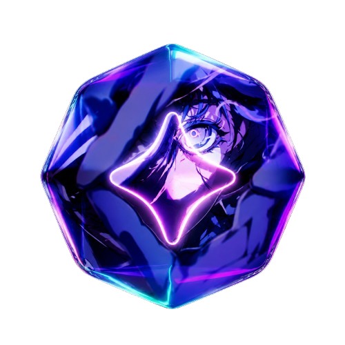
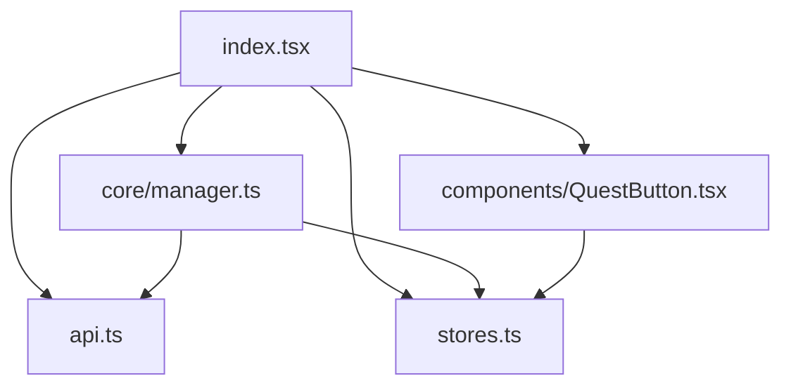

##  QuestCompleter

<p align="left">
  <a href="https://app.codacy.com/gh/xbl1e/questcompleter/dashboard?utm_source=gh&utm_medium=referral&utm_content=&utm_campaign=Badge_grade"></a>
  <a href="https://opensource.org/licenses/MIT"></a>
</p>

A Vencord plugin that automates supported Discord Quests by simulating the activity they require. It works directly inside Discord, so supported games do not need to be installed or running.

---

### &nbsp;&nbsp;Why?

Discord Quests can require installing games, playing for long periods, or streaming. QuestCompleter automates supported quests directly from the Discord client.

---

### &nbsp;&nbsp;Features

| Feature | Description |
| :--- | :--- |
| **Automatic enrollment** | Optionally finds and enrolls in supported available quests. |
| **Video progress** | Reports progress for `WATCH_VIDEO` and `WATCH_VIDEO_ON_MOBILE` quests. |
| **Desktop game activity** | Spoofs a running game for `PLAY_ON_DESKTOP` quests. |
| **Desktop streaming** | Spoofs stream metadata for `STREAM_ON_DESKTOP` quests. |
| **Activity heartbeats** | Sends activity heartbeats for `PLAY_ACTIVITY` quests. |

---

### &nbsp;&nbsp;Requirements

- **Windows** is required for the included `install.bat` installer.
- **Vencord** is required. The installer looks for it in `Downloads`, `Documents`, your user folder, or `Desktop`; if it cannot find it, it clones Vencord to `Documents\\Vencord`.
- The installer uses `winget` to install **Node.js LTS** and **Git** when they are missing, then installs **pnpm** and Vencord dependencies automatically.

### &nbsp;&nbsp;Configuration

Open `Settings -> User Settings -> Plugins -> QuestCompleter` after enabling the plugin.

| Setting | Default | Purpose |
| :--- | :--- | :--- |
| `hasAcceptedToUsePlugin` | `false` | Required consent. Disable it to force-stop automation. |
| `acceptQuestsAutomatically` | `false` | Enroll in eligible available quests automatically. |
| `showQuestsButtonSettingsBar` | `false` | Show the Quest button in the settings bar. Requires a Discord restart. |
| `showQuestsButtonBadges` | `true` | Show quest badges in Discord's quest UI. |
| `farmVideos` | `true` | Allow video and mobile-video quests. |
| `farmPlayOnDesktop` | `true` | Allow desktop play quests. |
| `farmStreamOnDesktop` | `true` | Allow desktop stream quests. |
| `farmPlayActivity` | `true` | Allow activity-heartbeat quests. |
| `farmRewardCodes` | `true` | Allow reward-code quests. |
| `farmInGame` | `true` | Allow in-game reward quests. |
| `farmCollectibles` | `true` | Allow collectible reward quests. |
| `farmVirtualCurrency` | `true` | Allow virtual-currency reward quests. |
| `farmFractionalPremium` | `true` | Allow fractional-premium reward quests. |

---

### &nbsp;&nbsp;Installation

#### Automatic Installer (Windows)

1. Clone or download this repository.
2. Run `install.bat`.
3. The installer copies the plugin into Vencord, installs dependencies, builds Vencord, and injects the stable client build. It downloads Vencord's installer CLI when needed.
4. Restart Discord.
5. Go to `Settings -> User Settings -> Plugins`, enable `QuestCompleter`, then accept the consent setting before starting automation.

#### Manual Installation

1. Copy or clone this repository to `Vencord/src/userplugins/QuestCompleter`.
2. In the Vencord root directory, run `pnpm install` and then `pnpm build`.
3. Install or inject your Vencord build using the normal Vencord workflow, then restart Discord.
4. Enable `QuestCompleter` in Discord's Plugins settings and accept the consent setting.

---

### &nbsp;&nbsp;Structure



```text
./
├── assets/
│   └── readme/             # README logo and section icons
├── core/
│   ├── farmer.ts           # Logic for individual quest task types
│   └── manager.ts          # Quest eligibility and auto-enrollment
├── components/
│   ├── QuestButton.tsx     # Discord UI integration
│   └── QuestButton.css     # Quest button styles
├── types/                  # Discord store and quest type declarations
├── index.tsx               # Plugin entry point and UI patches
├── api.ts                  # Discord quest API mapping
├── settings.ts             # User configuration
├── state.ts                # Runtime progress and spoofed state
├── stores.ts               # Webpack internal store mappings
├── install.bat             # Windows installer entry point
└── _run.ps1                # Installer script
```
